<div align="center">

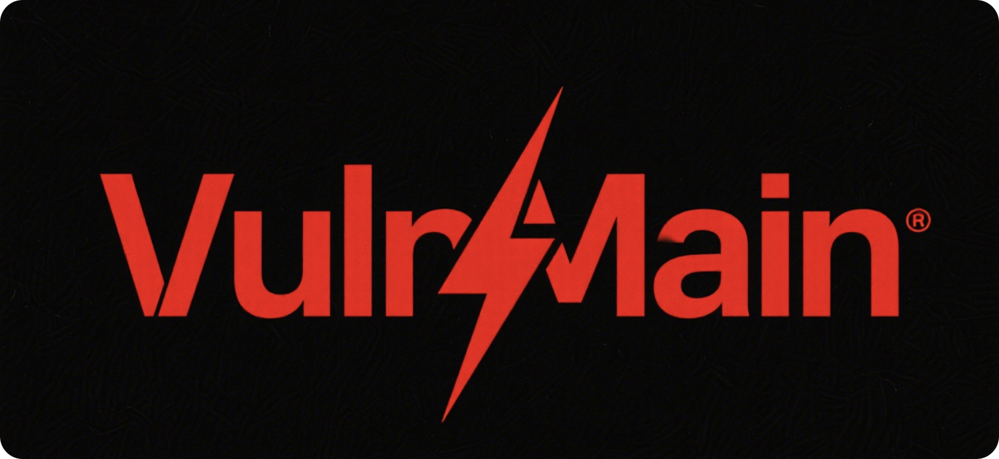


**一站式企业级漏洞管理与资产追踪平台，助力安全团队高效发现、跟踪与修复安全漏洞**

</div>

---

## 目录

- [项目简介](#项目简介)
- [功能特性](#功能特性)
- [系统预览](#系统预览)
- [快速部署](#快速部署)
  - [Docker 一键部署（推荐）](#docker-一键部署推荐)
  - [手动部署](#手动部署)
- [使用指南](#使用指南)
  - [登录系统](#1-登录系统)
  - [仪表盘](#2-仪表盘)
  - [项目管理](#3-项目管理)
  - [资产管理](#4-资产管理)
  - [漏洞管理](#5-漏洞管理)
  - [团队管理](#6-团队管理)
  - [用户管理](#7-用户管理)
  - [系统设置](#8-系统设置)
  - [周报管理](#9-周报管理)
- [权限体系](#权限体系)
- [Google 登录配置](#google-登录配置)
- [技术栈](#技术栈)
- [许可证](#许可证)

---

## 项目简介

VulnMain 是一个基于 **Go (Gin) + Next.js** 架构开发的企业级漏洞管理系统，为安全团队和开发团队提供完整的漏洞生命周期管理解决方案。

> 注：本项目处于持续开发迭代期，会不定期进行功能更新与优化。

### 核心价值

- **全流程管理**：从漏洞发现到修复验证的完整闭环
- **团队协作**：多角色权限管理，促进安全与开发团队协作
- **数据驱动**：丰富的统计分析与周报功能，助力安全决策
- **现代化界面**：基于 Semi UI 的响应式设计，提供优秀的用户体验
- **一键部署**：支持 Docker 容器化部署，开箱即用

---

## 功能特性

| 模块 | 功能说明 |
|------|----------|
| **仪表盘** | 系统概览、漏洞趋势统计、工程师排名、待处理事项提醒 |
| **项目管理** | 项目创建/编辑/归档、项目成员管理、项目统计数据 |
| **资产管理** | 资产录入/编辑/删除、资产分组与标签、批量导入导出（Excel）、审计日志 |
| **漏洞管理** | 漏洞全生命周期（待处理 → 修复中 → 已修复 → 已关闭）、漏洞关注者（Watcher）机制、漏洞评论（所有可查看用户均可评论）、时间线追踪、修复截止提醒、状态变更邮件通知 |
| **团队管理** | 团队创建/编辑/删除、团队成员管理、团队漏洞统计（仅统计未关闭漏洞）、团队漏洞列表（支持状态多选筛选）、基于团队的漏洞可见性控制 |
| **用户管理** | 用户增删改查、角色与权限分配、账户启用/禁用、密码策略配置 |
| **系统设置** | 基础配置（系统名称、公司名称）、邮件通知配置、LDAP/AD 集成、Google OAuth 登录、上传文件配置 |
| **周报管理** | 自动生成安全周报 PDF、邮件定时发送、历史周报查看与下载 |
| **认证方式** | 本地账号密码、LDAP/Active Directory、Google OAuth 2.0 |

---

## 系统预览

### 登录界面
支持本地账号和 Google 账号登录。

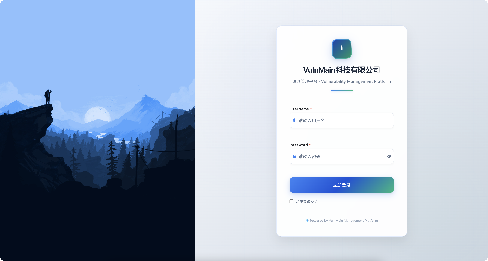

### 仪表盘
系统整体数据概览，包括漏洞统计、工程师排名等。

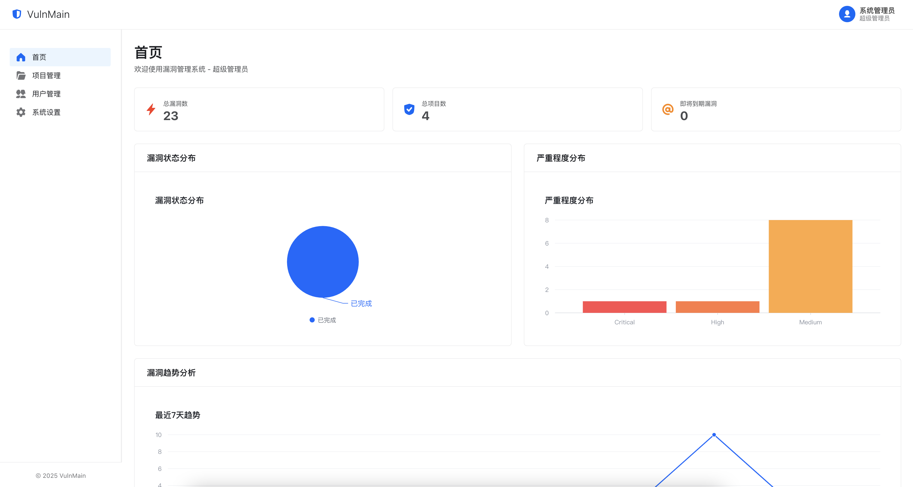

### 项目管理
创建和管理安全测试项目，分配项目成员。

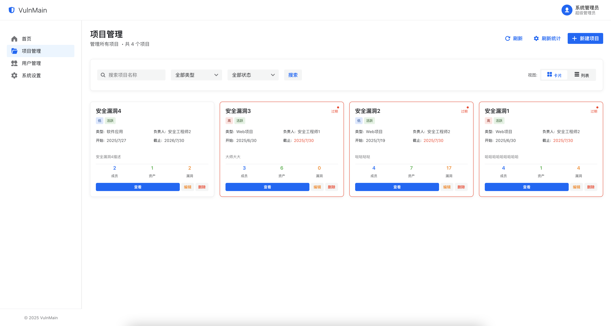

### 项目详情
查看项目下的资产、漏洞和成员信息。

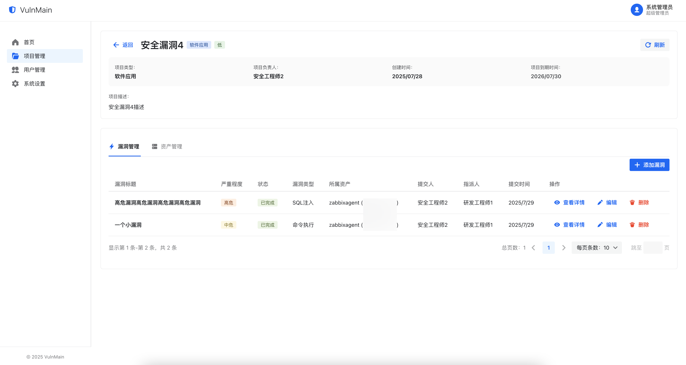

### 漏洞详情
漏洞完整信息，包含描述、修复建议、评论和处理时间线。

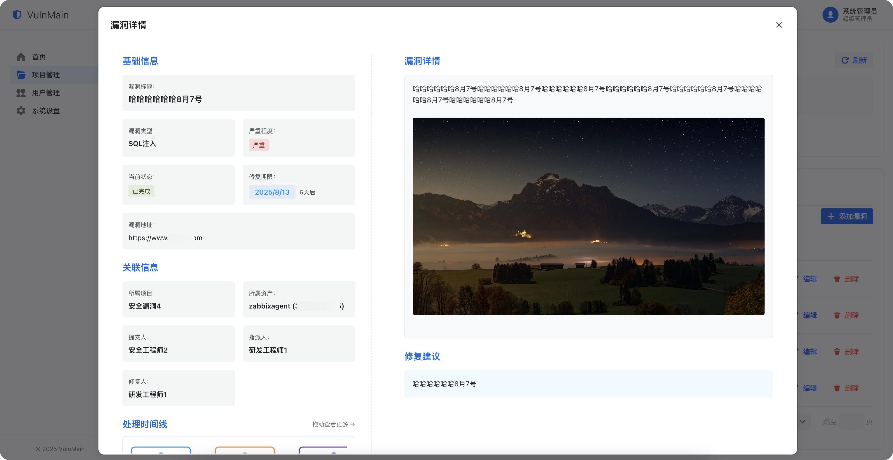

### 用户管理
管理系统用户，分配角色和权限。

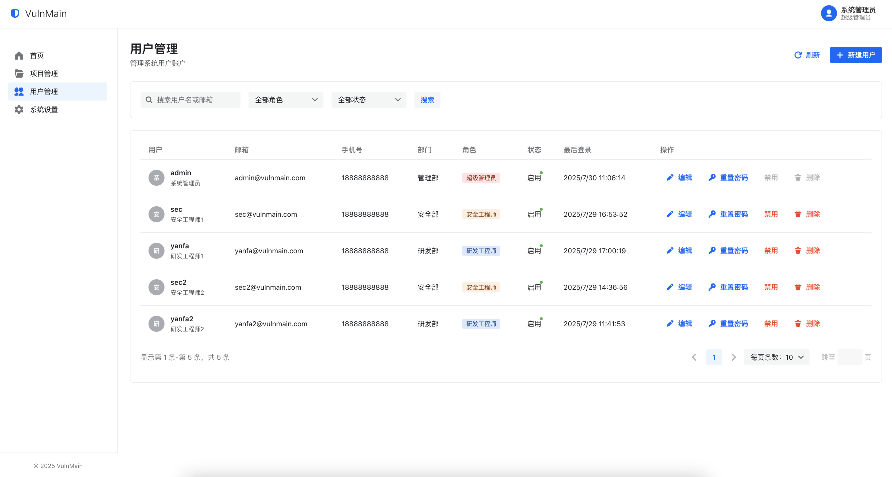

### 安全工程师视角
安全工程师的专属仪表盘，聚焦漏洞管理工作。

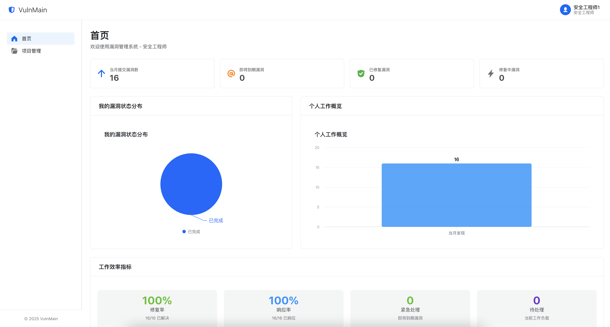

### 研发工程师视角
研发工程师的专属仪表盘，聚焦漏洞修复进度。

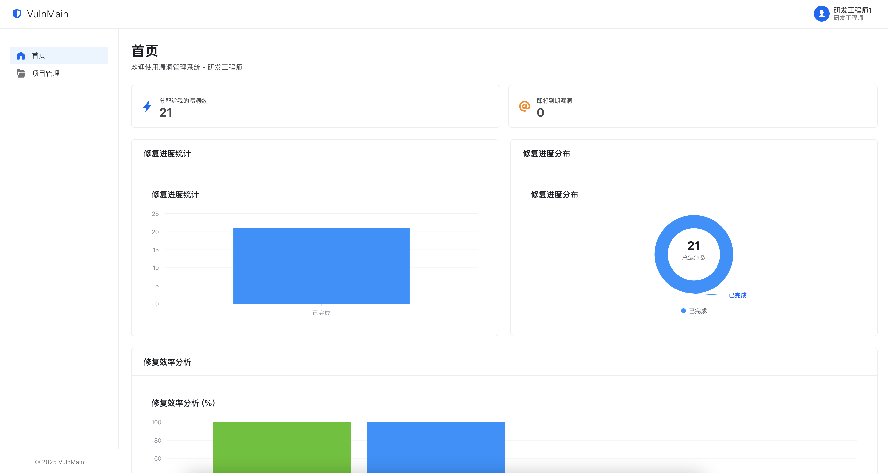

### 系统设置
配置系统基础信息、邮件、LDAP、Google 登录等。


### 周报管理
自动生成安全周报，支持 PDF 预览和邮件发送。

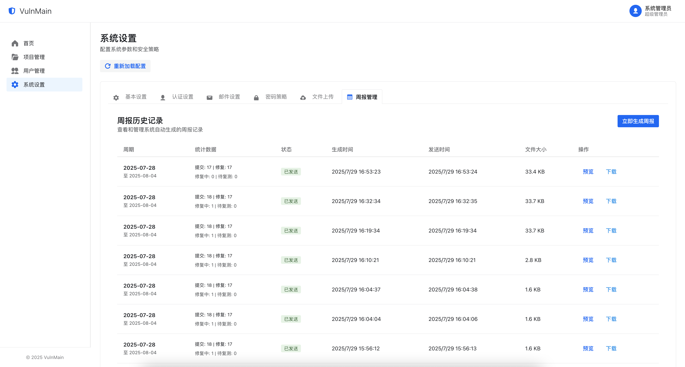

### 周报预览

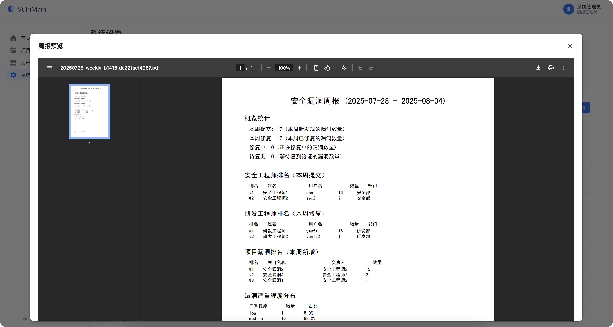

---

## 快速部署

### Docker 一键部署（推荐）

#### 环境要求

- Docker 20.10+
- Docker Compose v2+

#### 部署步骤

```bash
# 1. 克隆项目
git clone https://github.com/VulnMain/VulnMainProject.git
cd VulnMainProject

# 2. 一键部署（自动生成所有随机密码）
chmod +x deploy.sh
./deploy.sh
```

部署脚本会自动完成以下操作：
- 随机生成 MySQL Root 密码、数据库密码、管理员密码
- 构建前端和后端镜像
- 启动 MySQL 和应用容器

部署完成后，终端会输出所有账号密码信息：

```
============================================
  部署完成！
============================================
  访问地址:    http://localhost
  管理员账号:  admin
  管理员密码:  xxxxxxxxxxxxxxxxxxxx  ← 随机生成
============================================
```

> 所有密码保存在项目根目录的 `.env` 文件中，请妥善保管。

#### 自定义配置

部署前可编辑 `.env` 文件自定义配置：

```bash
# 应用端口（默认 80）
APP_PORT=80

# 管理员邮箱（首次初始化时写入）
ADMIN_EMAIL=admin@yourcompany.com

# Google OAuth 登录（可选）
GOOGLE_CLIENT_ID=xxx.apps.googleusercontent.com
GOOGLE_CLIENT_SECRET=xxx
GOOGLE_REDIRECT_URL=http://your-domain/api/auth/google/callback
```

#### 数据持久化

系统使用 Docker 命名卷持久化数据：

| 卷名 | 用途 |
|------|------|
| `mysql_data` | MySQL 数据库文件 |
| `app_uploads` | 上传的文件（附件、周报等） |

常规操作（restart、down、up --build）数据都会保留。**只有 `docker compose down -v` 会删除数据**。

#### 常用运维命令

```bash
# 查看运行状态
docker compose ps

# 查看日志
docker compose logs -f app

# 重启服务
docker compose restart

# 停止服务
docker compose down

# 重新构建并启动
docker compose up -d --build

# 清除所有数据重新部署（慎用）
docker compose down -v
./deploy.sh
```

---

### 手动部署

#### 环境要求

- Go 1.22+
- Node.js 16+
- MySQL 5.7+ 或 8.0+

#### 1. 创建数据库

```sql
CREATE DATABASE vulnmain CHARACTER SET utf8mb4 COLLATE utf8mb4_unicode_ci;
```

#### 2. 配置数据库连接

编辑 `config.yml`：

```yaml
server:
  port: 5000

datasource:
  driverName: mysql
  host: 127.0.0.1
  port: 3306
  database: vulnmain
  username: root
  password: your_password
  charset: utf8
```

#### 3. 启动后端

```bash
go mod tidy
go run main.go
```

后端服务启动在 `http://127.0.0.1:5000`

#### 4. 构建前端

```bash
cd web

# 修改 API 地址（编辑 src/lib/api.ts 中的 NEXT_PUBLIC_API_URL）
npm install
npm run build

# 将 out/ 目录部署到 Nginx 或其他 Web 服务器
```

#### 5. 默认管理员

- 用户名：`admin`
- 密码：`admin123`（手动部署的默认密码）

> 首次启动时系统会自动创建数据库表结构和默认数据。

---

## 使用指南

### 1. 登录系统

访问系统地址，使用管理员账号登录。系统支持三种登录方式：

- **本地账号**：使用用户名/邮箱 + 密码登录
- **LDAP 认证**：对接企业 Active Directory（需在系统设置中配置）
- **Google 登录**：使用 Google 账号一键登录（需配置 OAuth）

### 2. 仪表盘

登录后进入仪表盘页面，可查看：

- 漏洞总数、项目总数、即将到期漏洞数
- 漏洞状态分布（未修复、修复中、已修复、复测中等）
- 安全工程师提交排名
- 研发工程师修复排名
- 最新提交的漏洞列表

不同角色看到的仪表盘内容有所不同：
- **管理员/超级管理员**：查看全局数据
- **安全工程师**：聚焦自己提交和负责的漏洞
- **研发工程师**：聚焦分派给自己的待修复漏洞

### 3. 项目管理

#### 创建项目

1. 进入「项目管理」页面
2. 点击「创建项目」按钮
3. 填写项目信息：
   - **项目名称**：必填
   - **项目类型**：Web项目 / API接口 / 移动应用 / 软件应用
   - **优先级**：高 / 中 / 低
   - **项目描述**：项目背景和测试范围
   - **负责人**：指定项目负责人
   - **项目成员**：添加参与测试的工程师
   - **起止日期**：项目计划周期

#### 项目详情

点击项目名称进入详情页，可查看：
- 项目基本信息与统计数据
- 项目下的资产列表
- 项目下的漏洞列表
- 项目成员列表

### 4. 资产管理

#### 添加资产

在项目详情中点击「添加资产」：

- **资产名称**：如"生产Web服务器"
- **类型**：服务器 / 网络设备 / 数据库 / 存储设备 / 自定义
- **IP 地址 / 域名**：资产的网络标识
- **端口**：开放的服务端口
- **操作系统**：CentOS / Windows / Ubuntu 等
- **环境**：生产环境 / 测试环境 / 开发环境等
- **重要性**：极高 / 高 / 中 / 低

#### 批量操作

- **批量导入**：下载 Excel 模板，填写后上传导入
- **批量导出**：勾选资产后导出为 Excel 文件

### 5. 漏洞管理

#### 漏洞生命周期

```
待处理(pending) → 修复中(fixing) → 已修复(fixed) → 已关闭(closed)
                                        ↓
                                     驳回(rejected) → 重新修复
                    ↓
                 已忽略(ignored)（附忽略原因）
```

安全工程师提交漏洞后状态为「待处理」，研发工程师接收后进入「修复中」，修复完成标记为「已修复」，安全工程师复测通过后「关闭」漏洞。

#### 提交漏洞

在项目详情或团队详情中点击「创建漏洞」：

- **漏洞标题**：简明描述漏洞
- **漏洞地址**：漏洞触发的 URL
- **漏洞类型**：SQL注入 / XSS / CSRF / 命令执行 / 文件上传 / 信息泄露等
- **严重程度**：严重 / 高危 / 中危 / 低危 / 提示
- **漏洞描述**：详细描述，支持 Markdown 格式和图片上传
- **修复建议**：给开发人员的修复指导
- **指派给**：选择负责修复的研发工程师
- **修复截止时间**：要求修复的最后期限
- **CVE 编号**：可选，关联公开 CVE

#### 漏洞处理流程

| 角色 | 可执行操作 |
|------|-----------|
| **安全工程师** | 提交漏洞、分派、复测、关闭/驳回 |
| **研发工程师** | 查看分派给自己的漏洞、标记修复中、标记已修复 |
| **管理员** | 以上所有操作 |

#### 漏洞关注者（Watcher）

- 漏洞创建者或有编辑权限的用户可以通过邮箱添加关注者
- 关注者可以跨团队查看被关注的漏洞详情和列表
- 所有拥有漏洞查看权限的用户（包括关注者）均可发表评论

#### 漏洞详情页

- 查看漏洞完整信息
- 处理时间线（记录每一步状态变更操作）
- 评论区（所有可查看用户均可评论，促进安全与研发团队沟通）
- 关注者管理（添加/移除关注者）
- 状态变更时自动发送邮件通知相关人员

### 6. 团队管理

#### 团队列表

- 查看所有团队（管理员/安全工程师可见全部，其他角色仅可见所属团队）
- 每个团队显示未关闭漏洞数量统计（不含已关闭和已完成的漏洞）
- 支持关键词搜索团队

#### 团队详情

进入团队详情页可查看：

- **团队信息**：团队名称、描述、负责人、成员列表
- **团队漏洞列表**：显示该团队下所有漏洞，支持以下筛选：
  - **严重程度筛选**：按严重 / 高危 / 中危 / 低危 / 提示筛选
  - **状态多选筛选**：支持同时选择多个状态进行筛选（如同时查看「修复中」和「已修复」的漏洞）
  - **关键词搜索**：按漏洞标题搜索

#### 团队可见性规则

| 角色 | 可见范围 |
|------|----------|
| **管理员/安全工程师** | 所有团队及所有漏洞 |
| **团队负责人** | 自己负责的团队及团队内所有成员的漏洞 |
| **团队成员** | 所属团队中分配给自己的漏洞 + 作为关注者的漏洞 |

### 7. 用户管理

#### 添加用户

1. 进入「用户管理」页面
2. 点击「添加用户」
3. 填写信息：
   - **用户名**：必填，唯一标识
   - **邮箱**：必填，用于通知和 Google 登录匹配
   - **密码**：必填，需满足密码策略
   - **角色**：管理员 / 安全工程师 / 研发工程师
   - **真实姓名**：选填
   - **手机号**：选填
   - **部门**：必填

#### 用户操作

- **编辑用户**：修改用户信息和角色
- **启用/禁用**：控制用户登录权限
- **重置密码**：为用户重新设置密码

### 8. 系统设置

需要管理员权限访问，包含以下配置模块：

#### 基础配置
- 系统名称、公司名称、系统标题

#### 认证配置
- JWT 密钥和过期时间
- 密码策略（最小长度、复杂度要求）

#### 邮件配置
- SMTP 服务器地址和端口
- 发件人信息
- 支持测试邮件发送

#### LDAP 配置
- LDAP 服务器地址
- 用户查询和同步过滤器
- 属性映射（用户名、邮箱、部门等）
- 支持定时同步

#### Google 登录配置
- Client ID 和 Client Secret
- 回调地址

#### 文件上传配置
- 最大上传大小
- 允许的文件类型

### 9. 周报管理

系统支持自动生成安全周报 PDF：

- **周报内容**：本周提交漏洞数、修复数、工程师排名、项目排名、严重程度分布
- **手动生成**：点击按钮立即生成当周周报
- **PDF 预览**：在线预览周报内容
- **PDF 下载**：下载周报文件
- **邮件发送**：手动或定时发送周报到指定邮箱
- **历史记录**：查看和下载历史周报

---

## 权限体系

### 角色定义

| 角色 | 代码 | 权限范围 | 主要职责 |
|------|------|----------|----------|
| **超级管理员** | `super_admin` | 全部权限 | 系统初始账户，不可通过界面创建 |
| **管理员** | `admin` | 全部权限 | 可通过用户管理创建，权限与超级管理员一致 |
| **安全工程师** | `security_engineer` | 漏洞全流程 + 资产管理 | 漏洞录入、分派、复测、资产管理 |
| **研发工程师** | `dev_engineer` | 漏洞修复 | 查看和修复分派给自己的漏洞 |
| **普通用户** | `normal_user` | 仅浏览 | 最小权限，Google 登录自动创建的用户默认为此角色 |

### 权限矩阵

| 功能模块 | 超级管理员/管理员 | 安全工程师 | 研发工程师 | 普通用户 |
|----------|:-:|:-:|:-:|:-:|
| 查看仪表盘 | Y | Y | Y | - |
| 项目管理（增删改） | Y | - | - | - |
| 查看项目 | Y | Y（自己的） | Y（自己的） | - |
| 资产管理（增删改） | Y | Y | - | - |
| 漏洞提交 | Y | Y | - | - |
| 漏洞分派 | Y | Y | - | - |
| 漏洞修复（标记修复中/已修复） | Y | - | Y | - |
| 漏洞复测与关闭 | Y | Y | - | - |
| 漏洞评论 | Y | Y | Y（可查看的漏洞） | Y（关注者） |
| 漏洞关注者管理 | Y | Y | Y（自己的漏洞） | - |
| 团队管理（增删改） | Y | - | - | - |
| 查看团队 | Y | Y | Y（所属团队） | - |
| 用户管理 | Y | - | - | - |
| 系统设置 | Y | - | - | - |

---

## Google 登录配置

### 1. 获取 OAuth 凭据

1. 访问 [Google Cloud Console](https://console.cloud.google.com/)
2. 创建项目或选择已有项目
3. 导航至「API 和服务」→「凭据」
4. 创建「OAuth 2.0 客户端 ID」
5. 应用类型选择「Web 应用」
6. 添加授权重定向 URI：`http://你的域名/api/auth/google/callback`
7. 记录 Client ID 和 Client Secret

### 2. 配置系统

**方式一**：部署前在 `.env` 文件中配置

```bash
GOOGLE_CLIENT_ID=your-client-id.apps.googleusercontent.com
GOOGLE_CLIENT_SECRET=your-client-secret
GOOGLE_REDIRECT_URL=http://your-domain/api/auth/google/callback
```

**方式二**：部署后在「系统设置」页面配置

进入系统设置，找到 Google 配置组，填写 Client ID、Client Secret 和回调地址。

### 3. 登录流程

- 登录页自动检测 Google 登录是否启用
- 启用后显示「使用 Google 账号登录」按钮
- 点击后跳转 Google 授权，授权后自动回调
- 系统通过邮箱匹配用户，如不存在则自动创建（默认普通用户角色）
- 管理员可在用户管理中修改其角色

---

## 技术栈

### 后端

| 技术 | 版本 | 用途 |
|------|------|------|
| Go | 1.22+ | 核心语言 |
| Gin | 1.10+ | Web 框架 |
| GORM | 1.9+ | ORM |
| MySQL | 8.0+ | 数据库 |
| JWT-Go | 3.2+ | 身份认证 |
| Viper | 1.20+ | 配置管理 |
| OAuth2 | - | Google 登录 |
| go-ldap | 3.4+ | LDAP 集成 |
| fpdf | 0.9+ | PDF 生成 |
| excelize | 2.8+ | Excel 导入导出 |
| cron | 3.0+ | 定时任务 |

### 前端

| 技术 | 版本 | 用途 |
|------|------|------|
| Next.js | 14.2+ | React 框架（静态导出） |
| React | 18+ | UI 库 |
| TypeScript | 5+ | 类型系统 |
| Semi UI | 2.83+ | 企业级组件库 |
| Axios | 1.6+ | HTTP 客户端 |
| Recharts | 3.1+ | 数据图表 |

### 部署

| 技术 | 用途 |
|------|------|
| Docker | 容器化部署 |
| Docker Compose | 服务编排 |
| Nginx | 前端静态文件 + API 反向代理 |
| Alpine Linux | 最小化生产镜像 |

---

## 许可证

本项目采用 [Apache License 2.0](http://www.apache.org/licenses/LICENSE-2.0) 开源协议。

---

<div align="center">

**如果这个项目对您有帮助，请给本项目一个 Star！**

Made with ❤️ by VulnMain Team

</div>
